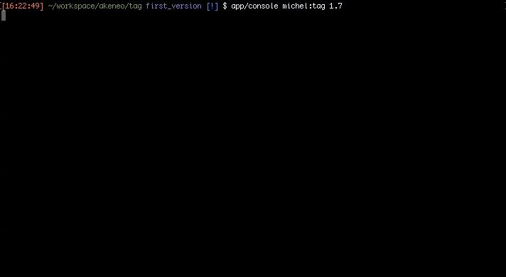

             _      _          _   _
        /\/\ (_) ___| |__   ___| | | |_ __ _  __ _
       /    \| |/ __| '_ \ / _ \ | | __/ _` |/ _` |
      / /\/\ \ | (__| | | |  __/ | | || (_| | (_| |
      \/    \/_|\___|_| |_|\___|_|  \__\__,_|\__, |
                                             |___/

# Michel Tag a new way to release Akeneo PIM

Hello dear releaser and welcome in the release command repository.
If you are here it's maybe because you want to release a new version of Akeneo PIM.
Follow me during the next steps to be fully ready to do so!

## Installation

    git clone https://github.com/juliensnz/michel-tag.git
    cd michel-tag
    composer install

## Configuration

Copy the `config.yml.dist` file and rename it to `config.yml` to add your github token.

## Release a new version

    app/console michel:tag 1.7

## Profit

